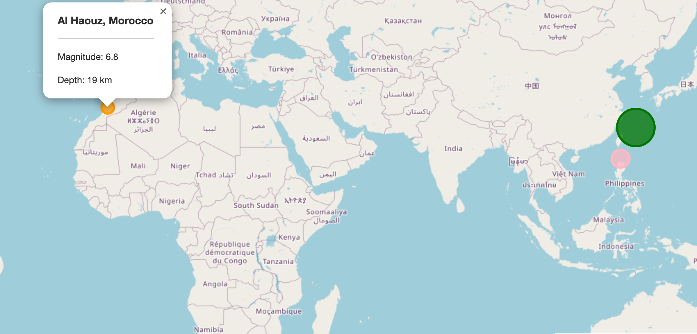

# leaflet-challenge



## Table of Contents
- [About](#About)
- [Contributing](#Contributing)
- [Tools](#Tools)
- [Analysis](#Analysis)

## About
In this project I created a visualization that mapped earthquake data from the United States Geological Survey(USGS).

## Contributing
- <a href="https://www.github.com/agostinger/" target="_blank">Adam Gostinger</a>
- <a href="https://www.github.com/Ryguy57/" target="_blank">Ryan Himes</a>

## Tools
- GeoJSON
- Leaflet
- HTML/CSS
- D3
- Javascript

## GeoJSON
Used D3 to read in GeoJSON data from [USGS]("https://earthquake.usgs.gov/earthquakes/feed/v1.0/summary/significant_month.geojson").

---------------------------------------------------
## **Leaflet**
1. Created a Leaflet map object:
``````
var myMap = L.map("map", {
  center: [10, 0],
  zoom: 3,
});
``````
2. Created a basemap layer:
``````
var streets = L.tileLayer('https://{s}.tile.openstreetmap.org/{z}/{x}/{y}.png', {
  attribution: '&copy; <a href="https://www.openstreetmap.org/copyright">OpenStreetMap</a> contributors'
}).addTo(myMap);
``````
3. Created markers on my map based on the earthquake data in the GeoJSON.
``````
// Load GeoJSON data and create markers with varying sizes based on depth
d3.json(url).then(function (data) {
  L.geoJson(data, {
    pointToLayer: function (feature, latlng) {
      const location = feature.properties.place; // Get the earthquake location
      const magnitude = feature.properties.mag; // Get the earthquake magnitude
      const depth = feature.geometry.coordinates[2]; // Get the earthquake depth
      const marker = L.circleMarker(latlng, styleInfo(feature));

      // Bind a popup with earthquake information
      marker.bindPopup(`<h3>${location}</h3><hr><p>Magnitude: ${magnitude}</p><p>Depth: ${depth} km</p>`);

      return marker;
    }
  }).addTo(myMap);
});
``````
---------------------------------------------------
4. Created a legend with modifications to the CSS
``````
 /* Style for the legend */
.info.legend {
  padding: 2px 2px;
  background: white;
  border: 1px solid #ccc;
  border-radius: 5px;
  font-size: 12px;
  text-align: left;
}

/* Style for legend color boxes */
.info.legend i {
  width: 18px;
  height: 18px;
  float: left;
  margin-right: 8px;
}
``````


---------------------------------------------------
## Analysis
This repository offers an interactive earthquake map crafted in JavaScript using Leaflet and D3.js. The map pinpoints earthquake locations with circle markers, where the marker size signifies the earthquake's magnitude and its color the depth. Users can pull 7-day GeoJSON earthquake data from the USGS API, view details like location and time on pop-ups, and switch between Street and Topographic map views. The map also features a color-coded depth legend. To use, simply clone the repository and open the index.html in a browser, allowing customization of the map type and marker management. The code is neatly organized into distinct functions for clarity, harnessing modern JavaScript (ES6) and focusing on data fetching, marker generation, and map presentation. It depends on Leaflet.js and D3.js for its functionalities. Credit goes to the US Geological Survey (USGS) for providing the earthquake data.
